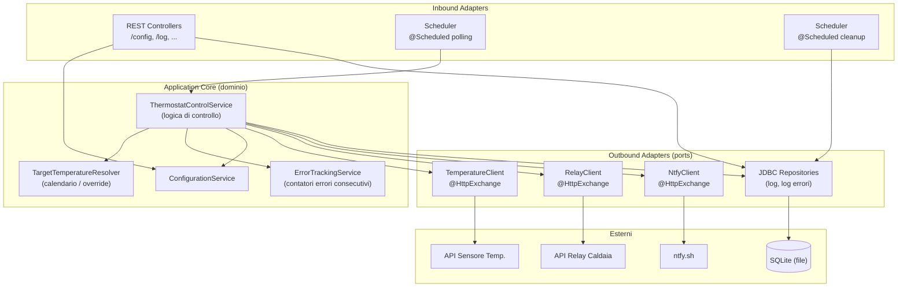
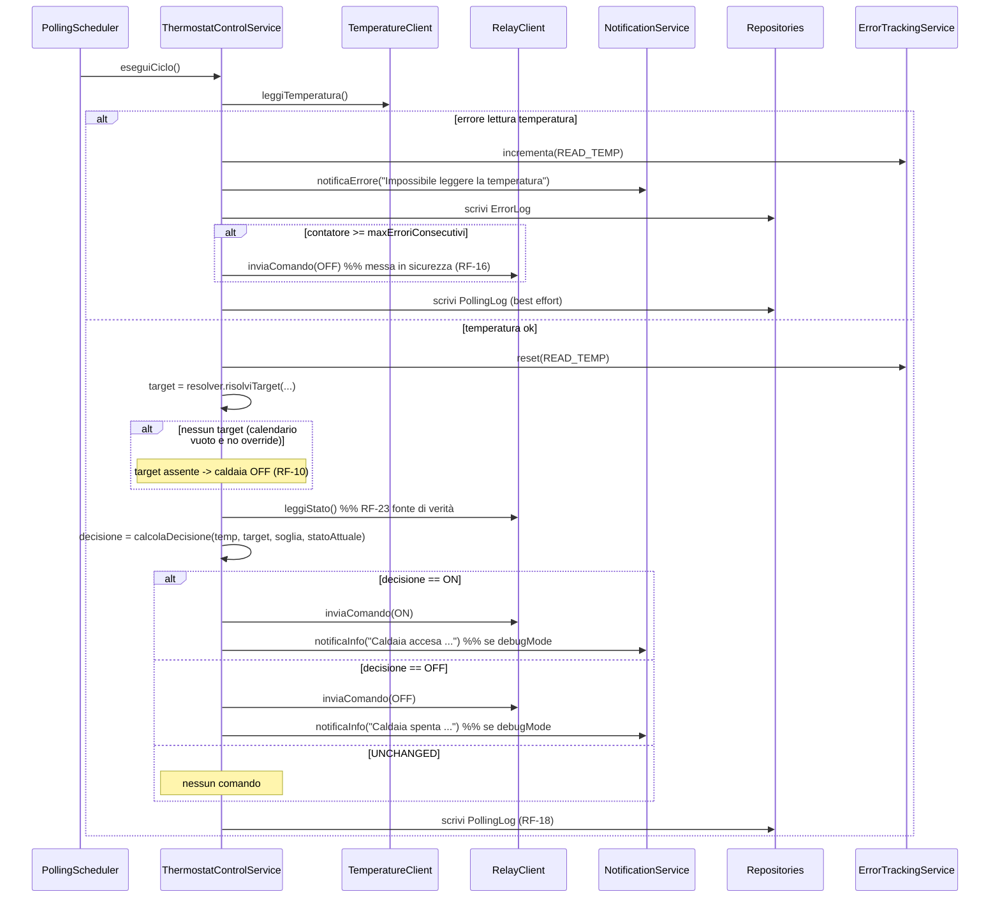
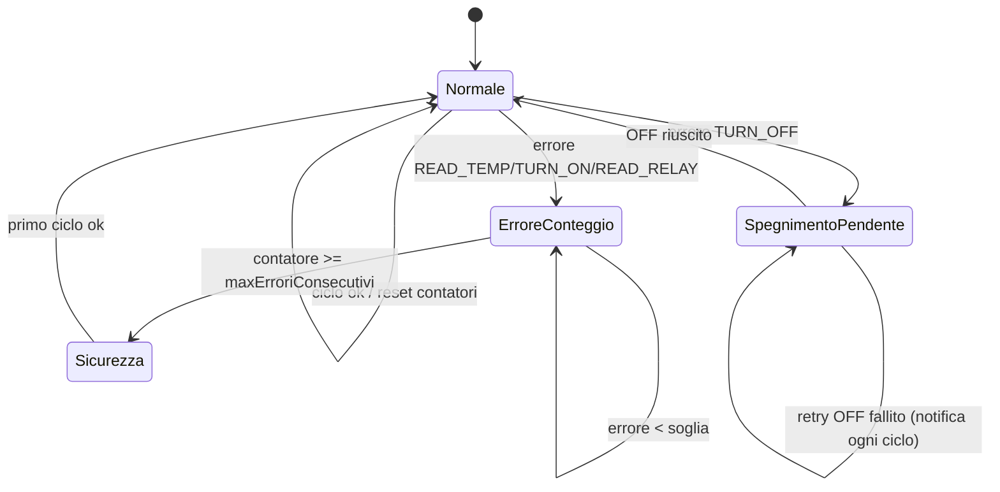

# Specifiche Tecniche — Termostato Intelligente (Spring Boot 4)

> Documento derivato dalle specifiche funzionali in `docs/specifiche-funzionali.md`.
> Descrive l'implementazione tecnica del sistema tramite Spring Boot 4.1.1 su Spring Framework 7.
> Ogni scelta tecnica è tracciata rispetto ai requisiti funzionali (RF-xx) e non funzionali (RNF-xx).

---

## 1. Stack tecnologico

| Componente | Scelta | Note / Motivazione |
|---|---|---|
| Linguaggio | **Java 21 (LTS)** | Spring Boot 4 richiede Java 17 come minimo; Java 21 è l'LTS consigliato. Java 25 è supportato ma non ancora LTS. |
| Framework | **Spring Boot 4.1.1** su Spring Framework 7 | Linea stabile corrente verificata sulla documentazione ufficiale; include HTTP Service Clients e modularizzazione dei jar. |
| Build tool | **Maven** (wrapper `mvnw`) | Gestione dipendenze e build riproducibile. Gradle è alternativa valida. |
| Web layer | **Spring Web MVC** (Tomcat embedded) | Il carico previsto è basso (front-end di gestione domestico); MVC sincrono è più semplice del reactive e sufficiente. |
| Client REST esterni | **Spring `RestClient` + HTTP Interface (`@HttpExchange`)** | Feature di prima classe in Spring Boot 4 per i client REST dichiarativi (RF-12, RF-13, RF-14, RF-21, RF-28). |
| Persistenza | **Spring JDBC (`JdbcTemplate`)** | Repository SQL espliciti per le due tabelle di log (RF-18, RF-20); evita dipendenze ORM non necessarie per SQLite. |
| Database | **SQLite** (file singolo) | Persistenza embedded su file, percorso configurabile (RF-36, RF-37). Nessun server DB esterno (RNF-05), driver `sqlite-jdbc` (Xerial). |
| Migrazioni schema | **Flyway** + `flyway-database-nc-sqlite` | Versionamento controllato dello schema; crea le tabelle al primo avvio se il file è nuovo. |
| Scheduling | **Spring `@Scheduled`** | Tick di polling (RF-11) e pulizia log oraria (RF-27). |
| Validazione | **Jakarta Bean Validation + validazione di dominio** | Validazione di config e calendario (RNF-03). I record di dominio rifiutano valori invalidi anche fuori dal layer HTTP. |
| Serializzazione JSON | **Jackson 3** | Default in Spring Boot 4. |
| Test | **JUnit 5, Mockito, Spring Boot Test** | Unit test del dominio e integrazione dei repository con SQLite su file temporaneo. |
| Osservabilità | **Spring Boot Actuator + Micrometer** | Health check e metriche. |
| Distribuzione | **Singolo jar eseguibile** (`java -jar termostato.jar`) | Nessun container. Richiede solo un runtime Java sulla macchina di destinazione (RNF-05). |

> **Nota su modularizzazione (Spring Boot 4):** i jar sono più granulari. Si dipende dai soli starter necessari:
> `spring-boot-starter-webmvc`, `spring-boot-starter-restclient`, `spring-boot-starter-jdbc`, `spring-boot-starter-validation`, `spring-boot-starter-flyway`, `spring-boot-starter-actuator`.

---

## 2. Architettura applicativa

### 2.1 Stile architetturale

Architettura **a layer con orientamento esagonale (ports & adapters)**: il dominio di controllo (logica termostato) è isolato dalle integrazioni esterne (client REST) e dalla persistenza tramite interfacce (porte). Questo soddisfa RNF-04 (gestione controllata degli errori esterni) e rende testabile il core con mock.



### 2.2 Struttura dei package

```
com.termostato
├── TermostatoApplication.java          # @SpringBootApplication, @EnableScheduling
├── config/
│   ├── BootstrapProperties.java         # default YAML e parametri bootstrap
│   ├── ConfigurationService.java        # JSON persistente e stato runtime
│   ├── DatabaseConfiguration.java       # DataSource SQLite + directory/WAL
│   └── TimeConfiguration.java
├── domain/
│   ├── control/
│   │   ├── ThermostatControlService.java
│   │   ├── TargetTemperatureResolver.java
│   │   ├── HeatingDecisionCalculator.java
│   │   ├── HeatingDecision.java        # enum: ON, OFF, UNCHANGED
│   │   └── ErrorTrackingService.java
│   └── model/
│       ├── Calendario.java             # 7 nodi giornalieri
│       ├── CalendarioDocument.java
│       ├── GiornoSettimana.java
│       ├── IntervalloOrario.java
│       └── SystemConfiguration.java
├── external/
│   ├── RestClientFactory.java           # proxy HTTP dinamici con timeout
│   ├── temperature/
│   │   ├── TemperatureClient.java      # adapter @HttpExchange
│   │   └── TemperatureReading.java
│   ├── relay/
│   │   ├── RelayClient.java             # adapter @HttpExchange
│   │   └── RelayCommand.java
│   └── notification/
│       ├── NtfyHttpApi.java             # @HttpExchange
│       └── NotificationService.java
├── persistence/
│   ├── PollingLogRecord.java
│   ├── ErrorLogRecord.java
│   ├── PollingLogRepository.java        # JdbcTemplate
│   └── ErrorLogRepository.java
├── scheduling/
│   ├── PollingScheduler.java           # RF-11
│   └── LogRetentionScheduler.java      # RF-27
└── web/
    ├── ConfigController.java           # RF-31, RF-32, RF-33
    ├── LogController.java              # RF-34, RF-35
    └── dto/                            # DTO request/response
```

---

## 3. Configurazione del sistema

### 3.1 Modello di configurazione (`BootstrapProperties` + `SystemConfiguration`)

Mappa i parametri della sezione 3 delle specifiche funzionali. Legato con `@ConfigurationProperties(prefix = "termostato")`.

| Campo | Tipo Java | Requisito | Default | Validazione |
|---|---|---|---|---|
| `sogliaAttivazione` | `BigDecimal` | RF-05, RF-08, RF-09 | `0.3` | `@DecimalMin("0.0")` |
| `overrideAttivo` | `boolean` | RF-06, RF-07 | `false` | — |
| `temperaturaOverride` | `BigDecimal` | RF-06 | `null` | obbligatorio se `overrideAttivo=true` |
| `intervalloPollingSecondi` | `int` | RF-11 | `60` | `@Positive`; fallback a 60 se non valido |
| `maxErroriConsecutivi` | `int` | RF-16 | `3` | `@Positive` |
| `retentionLogGiorni` | `int` | RF-26 | `30` | `@Positive` |
| `ntfyUrl` | `String` | RF-28 | `https://ntfy.sh` | `@NotBlank` |
| `ntfyTopic` | `String` | RF-28 | `sliverd` | `@NotBlank` |
| `debugMode` | `boolean` | RF-29, RF-30 | `false` | — |
| `sensore.url` | `String` | RF-12, RF-14 | — | `@NotBlank` (URL) |
| `relay.url` | `String` | RF-13, RF-14, RF-21 | — | `@NotBlank` (URL) |
| `databasePath` | `String` | RF-36, RF-37 | `./data/termostato.db` | `@NotBlank` (percorso file SQLite) |

> **Nota:** i valori di temperatura usano `BigDecimal` con scala 1 (RNF-02) per evitare imprecisioni float e garantire una sola cifra decimale.

### 3.2 Modificabilità a runtime (RNF-01)

La configurazione **deve essere modificabile senza riavvio**. Poiché `@ConfigurationProperties` legge da file solo all'avvio, la configurazione runtime è gestita da un **`ConfigurationService`** che:

1. Mantiene lo stato corrente in un bean applicativo (`@Component` con campo volatile / `AtomicReference`).
2. Espone getter thread-safe usati da scheduler e client.
3. All'aggiornamento via `PUT /config` (RF-32) valida e aggiorna lo stato in memoria, e persiste sul file JSON per sopravvivere ai riavvii.

> **Decisione tecnica:** la configurazione persistita e il calendario vengono salvati su **file JSON** su disco (coerente con RF-01 e la sezione 3 funzionale che separa config e calendario), con caricamento all'avvio e riscrittura atomica ad ogni `PUT`. In alternativa si può centralizzare su DB; il file JSON è stato scelto perché le specifiche indicano esplicitamente file JSON per il calendario (RF-01).

#### 3.2.1 Precedenza di caricamento e persistenza

Esistono due fonti per i valori di configurazione: i **default di bootstrap** in `application.yml` (sez. 10) e i **file JSON persistiti** (`config-file` per la configurazione, `calendario-file` per il calendario). La regola di precedenza è la seguente.

**Caricamento all'avvio:**

1. Il `ConfigurationService` verifica l'esistenza del file JSON di configurazione (`config-file`).
2. **Se il file esiste** → viene caricato e i suoi valori diventano la configurazione corrente. In questo caso il file JSON ha la **precedenza** sui default di `application.yml` (che restano solo valori di primo popolamento).
3. **Se il file non esiste** (primo avvio) → la configurazione corrente viene inizializzata dai **default definiti in `application.yml`** e il file JSON viene **creato immediatamente** scrivendo tali default. Da quel momento il file diventa la fonte autorevole.
4. La stessa logica si applica al calendario (`calendario-file`): se assente al primo avvio, viene creato un calendario di default (7 giorni, senza intervalli → comportamento sicuro "caldaia spenta", coerente con RF-10) e scritto su file.

> In sintesi: **`application.yml` fornisce i valori solo la prima volta**; una volta creato, il file JSON è la sorgente di verità per configurazione e calendario, e le modifiche successive via API vi vengono scritte.

**Persistenza degli aggiornamenti via API (`PUT /config`, `PUT /config/calendario`):**

1. Validazione del payload (Bean Validation).
2. Aggiornamento dello stato in memoria (effetto immediato su scheduler e client, senza riavvio — RNF-01).
3. **Scrittura atomica** del file JSON: si scrive su un file temporaneo nella stessa directory e poi si esegue un rename atomico (`Files.move` con `ATOMIC_MOVE`) sul file definitivo. Questo evita di lasciare un file JSON troncato/corrotto se il processo termina durante la scrittura.
4. In caso di errore di scrittura su disco, l'aggiornamento in memoria viene mantenuto ma l'API risponde con un errore che segnala la mancata persistenza, così l'utente sa che la modifica non sopravvivrà a un riavvio.

Al riavvio successivo si applica di nuovo la logica di caricamento sopra, quindi le modifiche persistite vengono ricaricate (punto 2).

### 3.3 Robustezza configurazione (RNF-03)

- Config mancante → si applicano i default della tabella 3.1.
- Config malformata → l'errore di parsing viene loggato, si mantiene l'ultima config valida (o i default all'avvio) e si invia notifica ntfy di errore.
- Il calendario malformato non blocca l'avvio: se non caricabile, il resolver tratta ogni momento come "nessun intervallo attivo" → caldaia spenta (comportamento sicuro, coerente con RF-10).

---

## 4. Calendario settimanale

### 4.1 Modello dati

```java
// Modello interno: calendario con esattamente 7 giorni
record Calendario(Map<GiornoSettimana, List<IntervalloOrario>> giorni) { }

// DTO JSON/API: le chiavi sono lunedi...domenica
record CalendarioDocument(Map<String, List<IntervalloOrario>> giorni) { }

// Intervallo (RF-04) — orari in UTC (RF-24)
record IntervalloOrario(
    LocalTime oraInizio,        // UTC
    LocalTime oraFine,          // UTC
    BigDecimal temperaturaTarget // scala 1
) { }
```

- Serializzazione/deserializzazione JSON con Jackson 3.
- `DayOfWeek` (java.time) come chiave: forza la presenza dei 7 giorni ed elimina ambiguità di ordinamento.
- **Validazione al caricamento e al `PUT /config/calendario`:** presenza dei 7 giorni (RF-02), `oraInizio < oraFine`, temperatura con una cifra decimale (RF-04).

### 4.2 Risoluzione temperatura target (`TargetTemperatureResolver`)

Implementa la sezione 8.2 delle specifiche:

```
Optional<BigDecimal> risolviTarget(Instant ora, Config config, Calendario cal):
    se config.overrideAttivo -> return config.temperaturaOverride        # RF-07
    utcNow = ora in UTC (LocalDateTime)                                  # RF-25
    giorno = utcNow.getDayOfWeek()
    per ogni intervallo in cal.giorni(giorno):
        se intervallo.contiene(utcNow.toLocalTime()) -> return target    # RF-03
    return Optional.empty()   # nessun intervallo -> caldaia spenta      # RF-10
```

> **Confronto UTC (RF-24, RF-25):** l'ora corrente è ottenuta come `Instant.now()` e convertita in `LocalDateTime` con `ZoneOffset.UTC`. Nessuna conversione a fuso locale, così da evitare ambiguità DST.
> **Semantica intervallo:** `oraInizio <= now < oraFine` (fine esclusa) per evitare sovrapposizioni ai bordi. La gestione di intervalli a cavallo di mezzanotte non è richiesta dalle specifiche (intervalli entro il giorno); se presente `oraFine <= oraInizio` viene rifiutato in validazione.

---

## 5. Client REST esterni (HTTP Service Clients)

Spring Boot 4 fornisce supporto di prima classe per HTTP Interface. Ogni client è un'interfaccia `@HttpExchange` la cui implementazione è generata a runtime tramite `HttpServiceProxyFactory` su `RestClient`. Gli URL base sono configurabili (RF-14).

### 5.1 Configurazione dei client (`HttpClientConfig`)

```java
@Configuration
class HttpClientConfig {

    @Bean
    TemperatureClient temperatureClient(RestClient.Builder builder, ConfigurationService cfg) {
        RestClient client = builder
            .baseUrl(cfg.getSensoreUrl())
            .requestFactory(timeoutRequestFactory()) // connect/read timeout
            .build();
        return HttpServiceProxyFactory.builderFor(RestClientAdapter.create(client))
            .build().createClient(TemperatureClient.class);
    }
    // analoghi per RelayClient e NtfyClient
}
```

- **Timeout obbligatori** su connect e read per non bloccare il ciclo di polling (contribuisce a RNF-04). Un timeout è trattato come errore API (sezione 4.3 funzionale).
- Gli URL base derivano da `ConfigurationService`. Se l'URL cambia a runtime, i client vengono ricreati (bean con scope aggiornabile o factory invocata per-chiamata leggendo l'URL corrente).

### 5.2 Client lettura temperatura (RF-12)

```java
@HttpExchange
interface TemperatureClient {
    @GetExchange("/temperature")
    TemperatureReading leggiTemperatura(); // { "temperatura": 19.3 }
}
```

- Invocato ad ogni ciclo di polling.
- Restituisce °C con una cifra decimale (mappato su `BigDecimal`).
- Errore/timeout/risposta invalida → categoria errore `READ_TEMP` (sezione 4.3).

### 5.3 Client relay caldaia (RF-13, RF-21, RF-22, RF-23)

```java
@HttpExchange
interface RelayClient {

    // Operazione 1 — lettura stato (RF-21). Invocata all'avvio (RF-22)
    // e ad ogni decisione che richiede lo stato (RF-23: nessuno stato in RAM).
    @GetExchange("/relay")
    RelayState leggiStato();

    // Operazione 2 — comando ON/OFF (RF-13)
    @PostExchange("/relay")
    void inviaComando(@RequestBody RelayCommand comando);
}
```

- **Fonte di verità = relay fisico (RF-23):** lo stato non è mai cachato. `ThermostatControlService` invoca `leggiStato()` ogni volta che serve lo stato corrente (zona neutra dell'isteresi, sezione 8.3).
- Errore lettura stato → categoria `READ_RELAY`; errore comando → `TURN_ON` o `TURN_OFF`.

### 5.4 Client notifiche ntfy (RF-28, RF-29, RF-30)

```java
@HttpExchange
interface NtfyClient {
    @PostExchange("/{topic}")
    void pubblica(@PathVariable String topic,
                  @RequestBody String messaggio,
                  @RequestHeader("Priority") String priorita); // "high" | "default"
}
```

`NotificationService` incapsula la logica:

| Tipo messaggio | Priorità | Condizione invio | Requisito |
|---|---|---|---|
| Errore | `high` | sempre | RF-15, RF-29 |
| Info accensione/spegnimento | `default` | solo se `debugMode = true` | RF-30 |

Esempi messaggi info: `"Caldaia accesa — temperatura rilevata 19.3°C, target 20.5°C"`.

> **Attenzione:** un fallimento nell'invio della notifica **non deve** propagarsi al ciclo di controllo. Viene loggato ma non conteggiato tra gli errori delle API di controllo (le specifiche 4.3 riguardano sensore e relay).

### 5.5 Profilo mock per sensore e relay

Per il primo test E2E è disponibile il profilo Spring `mock`, attivabile con `--spring.profiles.active=mock`. Il profilo registra controller HTTP condizionali nello stesso jar e configura i client sensore/relay con base URL `http://localhost:8080`:

| Endpoint mock | Metodo | Funzione |
|---|---|---|
| `/temperature` | `GET` | Risposta del sensore simulato (`{"temperatura": 19.0}`) |
| `/relay` | `GET` | Stato corrente del relay simulato (`{"acceso": false}`) |
| `/relay` | `POST` | Aggiorna lo stato del relay simulato |
| `/mock/temperature` | `PUT` | Cambia la temperatura simulata |
| `/mock/state` | `GET` | Restituisce temperatura e stato per le asserzioni E2E |
| `/mock/reset` | `POST` | Ripristina i valori iniziali del profilo |

Lo stato del relay nel mock è una `AtomicBoolean` del dispositivo simulato e non è usato dal `ThermostatControlService` come stato interno della caldaia. In produzione il mock controller non viene registrato (`termostato.mock-devices.enabled=false` di default).

Il client ntfy resta reale anche nel profilo mock: `ntfy-url=https://ntfy.sh`. `debug-mode` è `false` di default nel profilo per evitare notifiche informative durante lo scenario automatico; può essere abilitato esplicitamente.

Lo scenario `scripts/e2e-mock.ps1` verifica: avvio e health, creazione SQLite/JSON, relay inizialmente spento, accensione a temperatura 19.0 con target 20.5, cambio a 21.0 tramite `PUT /mock/temperature`, spegnimento successivo e presenza dei due stati nei log.

---

## 6. Logica di controllo

### 6.1 Avvio (RF-22, sezione 8.1)

All'avvio, tramite `ApplicationRunner` (o `@EventListener(ApplicationReadyEvent.class)`):

1. Legge lo stato del relay con `relayClient.leggiStato()`.
2. Non assume alcuno stato iniziale; se la lettura fallisce, applica la politica errori `READ_RELAY` (notifica + conteggio) e riprova al primo ciclo di polling.

### 6.2 Ciclo di polling (`PollingScheduler` → `ThermostatControlService`)

Eseguito ogni `intervalloPollingSecondi` (RF-11) con `@Scheduled(fixedDelayString = ...)` letto dinamicamente dalla config.



### 6.3 Algoritmo di decisione isteresi (sezione 8.3, RF-08, RF-09)

```
HeatingDecision calcolaDecisione(temp, targetOpt, soglia, statoAttuale):
    se targetOpt vuoto:                       # RF-10
        return (statoAttuale == ON) ? OFF : UNCHANGED
    target = targetOpt
    se temp <  target - soglia:  return ON     # RF-08
    se temp >= target:           return OFF    # RF-09
    return UNCHANGED                           # zona neutra: mantiene stato letto dal relay
```

- `statoAttuale` proviene **sempre** da `relayClient.leggiStato()` (RF-23).
- Il comando ON/OFF viene inviato solo quando la decisione cambia effettivamente lo stato, per ridurre chiamate inutili; la notifica info viene inviata solo su cambio effettivo.

### 6.4 Gestione errori e messa in sicurezza (RF-15, RF-16, RF-17, sezione 4.3)

`ErrorTrackingService` mantiene un contatore per categoria (`READ_TEMP`, `TURN_ON`, `READ_RELAY`).

- Ad ogni errore: incrementa il contatore, scrive `ErrorLog` (RF-20) e invia notifica (RF-15, RF-29).
- Al raggiungimento di `maxErroriConsecutivi`: **spegne la caldaia** (`inviaComando(OFF)`) (RF-16).
- Un ciclo di polling completato con successo **azzera** i contatori (sezione 3.4).
- **Caso speciale spegnimento (RF-17):** l'errore `TURN_OFF` **non** applica la soglia. Il sistema ritenta `inviaComando(OFF)` ad **ogni** ciclo, con notifica di errore ad ogni tentativo fallito, finché non riesce. Implementato con un flag persistente `spegnimentoPendente` valutato all'inizio di ogni ciclo, prima della normale logica.



---

## 7. Persistenza e log

### 7.0 Inizializzazione del database SQLite (RF-36, RF-37)

Il database è un singolo file SQLite il cui percorso deriva da `databasePath` (sez. 3.1). L'inizializzazione è eseguita dal bean `DatabaseConfiguration` prima dell'uso dei repository:

1. All'avvio `DatabaseConfiguration` risolve `database-path` dai parametri di bootstrap, crea le directory intermedie mancanti (`Files.createDirectories`) e costruisce un `SQLiteDataSource` con URL `jdbc:sqlite:{databasePath}`.
2. Il primo collegamento crea automaticamente il file se non esiste. Vengono impostati `busy_timeout`, `foreign_keys` e journal mode **WAL** (`PRAGMA journal_mode=WAL`).
3. Flyway, tramite `flyway-database-nc-sqlite`, applica `V1__create_log_tables.sql` sul file nuovo; se il file esiste, rileva la tabella di history e conserva i dati già presenti.

> Il parametro `database_path` è **bootstrap-only**: il DataSource SQLite è già aperto quando viene elaborata una richiesta `PUT /config`, quindi il servizio rifiuta un eventuale cambio di percorso a runtime. Le altre proprietà di configurazione sono invece aggiornabili e persistite senza riavvio.

> SQLite serializza le scritture. Il ciclo di polling e le query del front-end hanno un carico basso; WAL consente letture concorrenti durante le scritture.

### 7.1 Tabella log di polling (`polling_log`) — RF-18, RF-19

| Colonna | Tipo SQLite | Nullable | Campo funzionale |
|---|---|---|---|
| `id` | INTEGER PRIMARY KEY AUTOINCREMENT | no | — |
| `data_ora` | TEXT (ISO-8601 UTC) | no | `data_ora` |
| `caldaia_accesa` | INTEGER (0/1) | no | `caldaia_accesa` |
| `temperatura_rilevata` | REAL | no | `temperatura_rilevata` |
| `temperatura_target` | REAL | sì | `temperatura_target` (null se nessun intervallo) |
| `override_attivo` | INTEGER (0/1) | no | `override_attivo` |
| `temperatura_override` | REAL | sì | valorizzato solo se `override_attivo=true` |

- Un record ad ogni ciclo, indipendentemente dal cambio stato (RF-18, sezione 5.3).
- **Date in UTC come TEXT ISO-8601:** SQLite non ha un tipo timestamp nativo; gli `Instant` sono persistiti come stringhe ISO-8601 UTC a precisione fissa (es. `2026-09-03T08:29:56.000000000Z`). L'ordinamento lessicografico di questo formato coincide con l'ordinamento cronologico, quindi le query per range e la cancellazione retention funzionano correttamente.
- **Temperature come REAL:** SQLite non supporta `NUMERIC(4,1)`. I valori sono memorizzati come REAL e arrotondati a una cifra decimale a livello applicativo (`BigDecimal` scala 1, RNF-02) in lettura e scrittura.

### 7.2 Tabella log errori (`error_log`) — RF-20

| Colonna | Tipo SQLite | Nullable | Campo funzionale |
|---|---|---|---|
| `id` | INTEGER PRIMARY KEY AUTOINCREMENT | no | — |
| `data_ora` | TEXT (ISO-8601 UTC) | no | `data_ora` |
| `tipo_errore` | TEXT | no | `tipo_errore` |
| `caldaia_accesa` | INTEGER (0/1) | sì | stato se disponibile |
| `temperatura_rilevata` | REAL | sì | ultima temp se disponibile |
| `num_errori_consecutivi` | INTEGER | no | `num_errori_consecutivi` |

- Un record ad ogni errore di comunicazione con API esterne (sezione 5.4).

### 7.3 Repository

I repository sono adapter JDBC espliciti. Il contratto applicativo è:

```java
@Repository
class PollingLogRepository {
    void save(PollingLogRecord record);
    List<PollingLogRecord> findBetween(Instant fromInclusive, Instant toExclusive);
    int deleteBefore(Instant threshold); // RF-27
}
```

`ErrorLogRepository` espone le stesse operazioni per `ErrorLogRecord`. Gli `Instant` sono serializzati con precisione fissa in ISO-8601 UTC (`UtcInstantCodec`) così l'ordinamento TEXT di SQLite coincide sempre con quello temporale.

### 7.4 Migrazioni (Flyway)

Script `V1__create_log_tables.sql` con le due tabelle in sintassi SQLite (tipi come sopra) e indice su `data_ora` per efficienza di query per range e cancellazione retention. Flyway supporta SQLite; al primo avvio su file nuovo applica `V1` creando lo schema (RF-37).

---

## 8. Job di pulizia retention (RF-26, RF-27)

`LogRetentionScheduler` con `@Scheduled(cron = "0 0 * * * *")` (ogni ora):

```
soglia = Instant.now() - retentionLogGiorni giorni
pollingLogRepository.deleteByDataOraBefore(soglia)   # RF-27
errorLogRepository.deleteByDataOraBefore(soglia)     # RF-27
```

- Cancella da **entrambe** le tabelle i record con `data_ora < now - retention_log_giorni`.
- `retentionLogGiorni` letto dinamicamente dalla config corrente.
- Operazione in transazione con logging del numero di record eliminati.

---

## 9. API REST esposte

Controller MVC. Tutti i timestamp in ingresso/uscita in UTC. DTO dedicati separano il modello di dominio dal contratto REST.

### 9.1 Configurazione — RF-31, RF-32, RF-33

| Metodo | Endpoint | Handler | Requisito | Note |
|---|---|---|---|---|
| `GET` | `/config` | `ConfigController#getConfig` | RF-31 | ritorna tutti i parametri correnti |
| `PUT` | `/config` | `ConfigController#updateConfig` | RF-32, RNF-01 | valida, aggiorna in memoria + persiste; nessun riavvio |
| `GET` | `/config/calendario` | `ConfigController#getCalendario` | RF-33 | ritorna il calendario settimanale |
| `PUT` | `/config/calendario` | `ConfigController#updateCalendario` | RF-33, RF-02 | valida 7 giorni + intervalli |

Il payload del calendario usa un wrapper `giorni`, con esattamente le sette chiavi italiane canoniche:

```json
{
  "giorni": {
    "lunedi": [],
    "martedi": [],
    "mercoledi": [],
    "giovedi": [
      { "ora_inizio": "06:00", "ora_fine": "08:00", "temperatura_target": 20.5 }
    ],
    "venerdi": [],
    "sabato": [],
    "domenica": []
  }
}
```

Il body di `PUT /config` ha i campi snake_case restituiti da `GET /config`. `database_path` deve rimanere invariato rispetto al valore di bootstrap; gli altri campi sono validati, applicati immediatamente e persistiti nel file JSON.

### 9.2 Log di polling — RF-34

| Metodo | Endpoint | Requisito |
|---|---|---|
| `GET` | `/log?da={data}&a={data}` | RF-34 |

Regole parametri (sezione 7.2):
- Nessun parametro → log del **giorno corrente UTC** (`[startOfDayUtc, endOfDayUtc]`).
- Solo `da` → da `da` fino a fine del giorno corrente UTC.
- Range `[da, a]` inclusivo su entrambi gli estremi.

### 9.3 Log di errore — RF-35

| Metodo | Endpoint | Requisito |
|---|---|---|
| `GET` | `/log/errori?da={data}&a={data}` | RF-35 |

Stesse regole di default e range del punto 9.2 (sezione 7.3).

### 9.4 Gestione errori HTTP

`@RestControllerAdvice` centralizzato:
- `400` per body/parametri non validi (Bean Validation).
- `404` per risorse inesistenti.
- `500` con messaggio sintetico per errori interni; dettaglio nei log applicativi.

---

## 10. Configurazione applicativa (`application.yml`)

```yaml
termostato:
  soglia-attivazione: 0.3
  override-attivo: false
  temperatura-override: null
  intervallo-polling-secondi: 60
  max-errori-consecutivi: 3
  retention-log-giorni: 30
  ntfy-url: https://ntfy.sh
  ntfy-topic: sliverd
  debug-mode: false
  sensore:
    url: http://sensore.local
  relay:
    url: http://relay.local
  # percorso file di persistenza config/calendario
  config-file: ./data/config.json
  calendario-file: ./data/calendario.json
  # percorso file database SQLite (RF-36, RF-37)
  database-path: ./data/termostato.db

spring:
  application:
    name: termostato
  jackson:
    property-naming-strategy: SNAKE_CASE
  flyway:
    enabled: true
    locations: classpath:db/migration

server:
  port: 8080

management:
  endpoints.web.exposure.include: health,info,metrics
```

Il bean `DatabaseConfiguration` costruisce il `SQLiteDataSource` direttamente da `termostato.database-path`; non sono necessarie proprietà `spring.datasource`, credenziali DB o configurazione JPA. Ulteriori parametri applicativi implementati sono `http-timeout-millis` e `scheduler-tick-millis`.

---

## 11. Strategia di test

| Livello | Oggetto | Strumenti |
|---|---|---|
| Unit | `TargetTemperatureResolver` (calendario/override, UTC, RF-07/RF-10/RF-24/RF-25) | JUnit 5 |
| Unit | `calcolaDecisione` isteresi (RF-08/RF-09, zona neutra) | JUnit 5 (parametrizzati) |
| Unit | `ErrorTrackingService` (soglia, reset, caso TURN_OFF RF-16/RF-17) | JUnit 5 |
| Integrazione | Client `@HttpExchange` (temp/relay/ntfy) | RestClient stub / MockWebServer |
| Integrazione | Repository + retention (RF-27) | SQLite su file temporaneo (stesso motore della produzione) |
| Integrazione | Inizializzazione DB: creazione file se assente (RF-37) | Smoke test jar + file temporaneo |
| Integrazione | Controller REST (RF-31..RF-35, default giorno corrente) | Smoke test HTTP + test `UtcDateRange` |
| End-to-end | Ciclo di polling completo con stub esterni | Test Mockito del `ThermostatControlService` |

Casi limite obbligatori da coprire:
- Avvio con lettura relay fallita (RF-22).
- Nessun intervallo attivo → caldaia spenta (RF-10).
- Zona neutra → stato invariato letto dal relay (RF-23, sezione 8.3).
- Errore spegnimento ritentato ogni ciclo senza soglia (RF-17).
- Config malformata → default e continuità di servizio (RNF-03).

---

## 12. Distribuzione ed esecuzione

- **Artefatto:** singolo **jar eseguibile** (fat jar) prodotto da `mvn clean package` (`spring-boot-maven-plugin`). Nessun container.
- **Esecuzione da console:**
  ```
  java -jar termostato.jar
  ```
  Opzionalmente si sovrascrivono i parametri, ad esempio il percorso del DB:
  ```
  java -jar termostato.jar --termostato.database-path=/opt/termostato/data/termostato.db
  ```
- **Requisiti macchina di destinazione (RNF-05):** solo un **runtime Java 21** (JRE/JDK). Nessun server di database, nessun Docker. Il driver `sqlite-jdbc` include la libreria nativa SQLite per le principali architetture (x86-64, ARM64), quindi funziona anche su Raspberry Pi.
- **Persistenza su disco:** il file SQLite (`database-path`) e i file JSON di config/calendario risiedono nella directory dati indicata in configurazione; vanno inclusi nei backup. All'avvio, se il file DB non esiste viene creato (RF-37).
- **Avvio automatico (opzionale):** su Linux si può registrare un servizio `systemd` che lancia `java -jar`; su Windows un servizio tramite NSSM o Task Scheduler. Impostare `TZ=UTC` per coerenza dei log applicativi (la logica è comunque interamente in UTC).
- **Health check:** endpoint `management/health` di Actuator.

---

## 13. Matrice di tracciabilità requisiti → implementazione

| Requisito | Componente / Sezione |
|---|---|
| RF-01, RF-02, RF-03, RF-04 | Sez. 4 (Calendario, modello + validazione) |
| RF-05, RF-08, RF-09 | Sez. 6.3 (`calcolaDecisione`) |
| RF-06, RF-07 | Sez. 4.2 (`TargetTemperatureResolver`) |
| RF-10 | Sez. 4.2 / 6.3 (target assente → OFF) |
| RF-11 | Sez. 6.2 (`PollingScheduler`) |
| RF-12 | Sez. 5.2 (`TemperatureClient`) |
| RF-13, RF-21 | Sez. 5.3 (`RelayClient`) |
| RF-14 | Sez. 5.1 (URL configurabili) |
| RF-15, RF-29 | Sez. 5.4 / 6.4 (notifiche errore) |
| RF-16 | Sez. 6.4 (soglia → OFF) |
| RF-17 | Sez. 6.4 (retry spegnimento) |
| RF-18, RF-19 | Sez. 7.1 (`polling_log`) |
| RF-20 | Sez. 7.2 (`error_log`) |
| RF-22, RF-23 | Sez. 6.1 / 5.3 (stato dal relay, no RAM) |
| RF-24, RF-25 | Sez. 4.2 (UTC) |
| RF-26, RF-27 | Sez. 8 (retention scheduler) |
| RF-28, RF-30 | Sez. 5.4 (ntfy, debug_mode) |
| RF-31..RF-35 | Sez. 9 (API REST) |
| RF-36, RF-37 | Sez. 7.0 (SQLite, init automatica del file) |
| RNF-01 | Sez. 3.2 (`ConfigurationService`) |
| RNF-02 | Sez. 3.1 / 7 (`BigDecimal` scala 1, colonne REAL arrotondate) |
| RNF-03 | Sez. 3.3 (robustezza config) |
| RNF-04 | Sez. 5.1 / 6.4 (timeout + gestione errori) |
| RNF-05 | Sez. 1 / 12 (jar eseguibile, solo Java, SQLite embedded) |

---

## 14. Confidence Assessment

| Ambito | Confidenza | Motivazione |
|---|---|---|
| Versione e requisiti Spring Boot 4 (Java 17+, Framework 7, HTTP Service Clients) | **Alta** | Verificato su annuncio GA ufficiale spring.io (20/11/2025) e migration guide. |
| Mappatura RF/RNF → componenti | **Alta** | Derivata direttamente dal testo delle specifiche funzionali. |
| Scelta MVC vs WebFlux, Flyway e repository JDBC | **Media** | Scelte progettuali ragionevoli per il dominio; non imposte dalle specifiche, alternative valide esistono. |
| Persistenza su SQLite file singolo + jar eseguibile (no Docker) | **Alta** | Deciso esplicitamente dallo stakeholder e formalizzato in RF-36, RF-37, RNF-05. |
| Uso di Flyway con `flyway-database-nc-sqlite` | **Alta** | Verificato nello smoke test: Flyway ha applicato la migrazione V1 su un file SQLite nuovo. |
| Persistenza config/calendario su file JSON | **Media** | Le specifiche citano file JSON per il calendario (RF-01); per la config la scelta è progettuale. |
| Contratto esatto delle API esterne (path, formato payload sensore/relay/ntfy) | **Bassa** | Le specifiche indicano solo che gli endpoint sono configurabili; path e schema JSON qui sono ipotesi da confermare con i dispositivi reali. |

### Punti da confermare con lo stakeholder
1. Schema JSON esatto di richiesta/risposta di sensore, relay e ntfy (payload e header).
2. Comportamento desiderato per intervalli a cavallo di mezzanotte (attualmente non previsti dalle specifiche).
